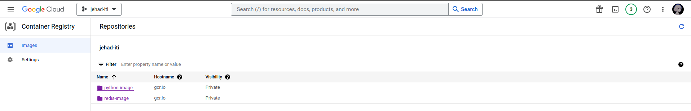
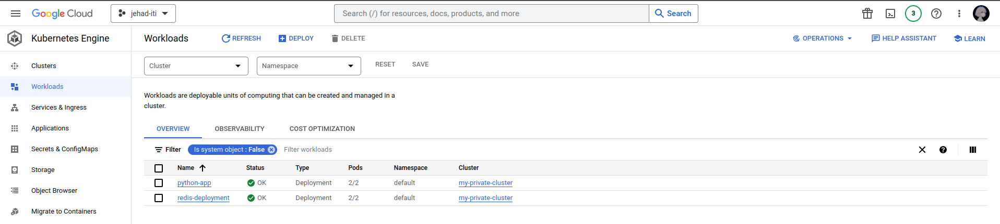
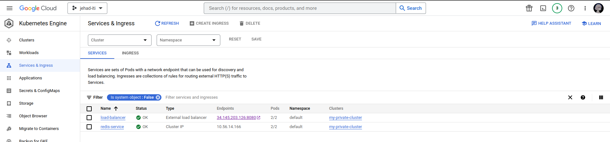
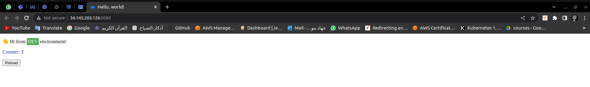

# GCP Final project

### Build python docker image from Dockerfile, push to GCR :
  ```bash

  $ docker build . -t gcr.io/jehad-iti/python-image
  $ docker push gcr.io/jehad-iti/python-image

  ```
### Pull redis image from DockerHub, push to GCR :
  ```bash

  $ docker pull redis
  $ docker tag redis gcr.io/jehad-iti/redis-image
  $ docker push gcr.io/jehad-iti/redis-image

  ```


### Use terraform commands:
  ```bash

  $ terraform init
  $ terraform plan
  $ terraform apply

  ```

### SSh to VM and install following: 
  ```bash
  
$ sudo apt install -y apt-transport-https ca-certificates gnupg

$ echo "deb [signed-by=/usr/share/keyrings/cloud.google.gpg] https://packages.cloud.google.com/apt cloud-sdk main" | sudo tee -a /etc/apt/sources.list.d/google-cloud-sdk.list

$ curl https://packages.cloud.google.com/apt/doc/apt-key.gpg | sudo tee /usr/share/keyrings/cloud.google.gpg

$ sudo apt-get update && sudo apt-get install -y google-cloud-cli

$ sudo apt-get install kubectl

$ sudo apt-get install google-cloud-sdk-gke-gcloud-auth-plugin

  ```

### Connect to cluster:
  ```bash

  $ gcloud container clusters get-credentials private-cluster --zone us-east4-c --project jehad-iti

  ```
### Copy yml files to VM:
  ```bash

  $ gcloud compute scp --recurse deployment/ private-vm:/home/jehad --zone us-east4-c --tunnel-through-iap
  
  ``` 
### Apply All yml Files on VM:
  ```bash

  $ Kubectl create -f deployment

  ```

## workloads

## services


### Loadbalancer IP with port in browser



